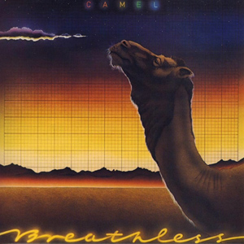

{fig-align="center"}

*Breathless* es una estupenda introducción a Camel: tiene los solos de guitarra de Latimer y los impecables arreglos de Peter Bardens en formato de canción pop. Es el Camel más agradable, de buen rollo y melódico.

La canción favorita de los fans es *Echoes*: casi instrumental, con un gran solo de guitarra de Andy Latimer. Hay un tema de jazz (*The Sleeper*), un tema de Canterbury y de apología de la vida rural (*Down on the Farm*) y una serie de canciones pop perfectas. La que más me gusta es *Summer Lightning*. En el remaster de 2003 arreglaron una ligera distorsión de velocidad que aparecía en la versión original.

Es el último disco de Camel con Peter Bardens. Luego Latimer convertiría a Camel en su proyecto en solitario con músicos de Alan Parsons.

