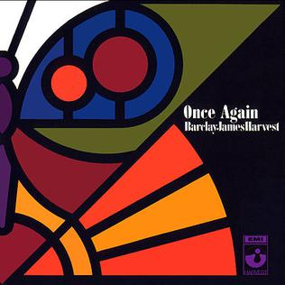

{fig-align="center"}

*Once Again*, el segundo disco de Barclay James Harvest (BJH), es el primero de las obras clásicas del grupo. Representa la expresión más lograda de su primera etapa: reciben las influencias del blues americano (pasado por el filtro inglés de Eric Clapton) y las mezclan con la tradición musical europea, la llamada música clásica. Aunque no se recuerde mucho hoy, fue uno de los discos fundadores del *art rock* y del rock sinfónico, en el sentido mahleriano del término. 

Como grupo de cuatro instrumentistas, BJH funciona muy bien: el trabajo de guitarra de John Lees es excepcional, Les Holroyd y Mel Pritchard son una sección rítmica excelente y Woolly Wolstenholme destaca como cantante y tejiendo fondos con el Mellotron. Además tres de sus miembros son buenos cantantes, así que pueden introducir armonías vocales. Al ser personas jóvenes y sensitivas, es un disco bastante oscuro, sobre todo en *Happy Old World*, *Song for Dying* y *Ball and Chain*. En esa época, BJH era conocido como un grupo que empleaba la orquesta sinfónica. Por eso se les ha comparado desde siempre con los Moody Blues. En *Once Again* hay orquesta en dos temas: *Mockingbird* y *Galadriel*. Creo que los arreglos orquestales de Robert Godfrey, que tantos dolores de cabeza dieron años después, restan más que suman. En una de las reediciones de *Once Again* se presentan las versiones sin orquesta de estas dos canciones, que son netamente superiores a la versión orquestal: más al grano, sin florilegios innecesarios.

Presentado en 1971 (en febrero de 2026 hará cincuenta y cinco años), *Once Again* representa la mejor expresión de la primera época de BJH. *Mockingbird* estuvo siempre en los *setlist* de las giras del grupo, en una versión muy similar a la que grabaron sin orquesta, añadiendo al final un gran solo de guitarra.

Para saber más: <https://www.bjharvest.co.uk/once.htm>

