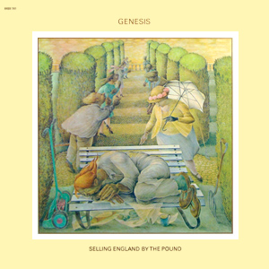

{fig-align="center"}

*Selling England by the Pound* es el cuarto álbum de Genesis, si obviamos *from Genesis to Revelation*. Para muchos es la cumbre de la época inglesa de Genesis, y para mi es un disco excepcional, como todos los de Genesis con Gabriel y Hackett. La producción es más clara que en *Foxtrot*, quizá con la excepción de *The Battle of Epping Forest*. El título *Selling England by the Pound* viene de un manifiesto del Partido Laborista, en el que se sugería que se estaba vendiendo “a peso” Inglaterra a Estados Unidos. A principios de los setenta, el Reino Unido veía cómo se iba transformando de imperio a país. Esa nostalgia por la Inglaterra que fue, a punto de ser superada y “comprada” por los Estados Unidos, es el *leitmotiv* del álbum.

Algunos de los temas del álbum son estampas de esa Inglaterra a punto de dejar de ser lo que fue: *Dancing with the Moonlit Knight*, *I Know What I Like*, *The Battle of Epping Forest*, *Cinema Show* y *Aisle of Plenty*. *Firth of Fifth* y *After the Ordeal* pueden verse como temas de música clásica en formato de banda de rock. Finalmente, *More Fool Me* es un tema de acústica y voz interpretado por Collins y Rutherford.

*Selling England* es uno de los grandes discos de Genesis, y ha sido más influyente de lo que se quiso reconocer en los ochenta y noventa. I *Know What I Like* es el primer single del grupo, y *Firth of Fifth* y *Cinema Show* han estado presentes en los shows en directo del grupo desde entonces. Es el disco de Genesis favorito de Steve Hackett, el miembro de Genesis que se ha dedicado a difundir en directo el legado del grupo.

