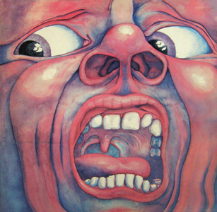

{fig-align="center"}

Este es un disco que inaugura muchas cosas. Inaugura King Crimson (KC), el artefacto más relevante con el que Robert Fripp ha vehiculado su creatividad hasta hoy. También inaugura el rock progresivo, género predominante en este blog. El tema más relevante es el que abre el disco: *21st Century Schizoid Man*. Allí están los riffs que darían lugar al hard rock, las cabalgadas a cien por hora perfectamente sincronizadas, el delicado equilibrio entre caos y control y el anuncio de la llegada del hombre esquizoide del siglo XXI, hoy presente entre nosotros. La distorsión de la voz es plenamente actual, apareció en algunos anuncios de colonia el año pasado incorporada por Kanye West a su tema *Power*. Esto da idea de la relevante de *21st Century* en la cultura popular anglosajona. 

El tema que cierra el disco, *The Court of the Crimson King*, representa el KC de Ian McDonald: épicas capas y capas de Mellotron, combinadas con elaboradas orquestaciones de instrumentos de viento. La síntesis de estos dos temas define las señas de identidad del rock progresivo de los setenta: solvencia técnica, largos pasajes instrumentales, superación del esquema clásico de la canción pop y uso extensivo de instrumentos de teclado, sobre todo Mellotron. 

Entre medio tenemos tres temas. Mientras *I Talk to the Wind* es el KC lírico, *Epitaph* reitera la fórmula del KC épico. Aquí brilla la voz de Greg Lake, y es el germen de ELP. El tema menos conocido es *Moonshine*: es una canción perfecta de dos minutos y medio, unida a dos improvisaciones que se extienden durante diez minutos. Esos diez minutos son los menos escuchados, pero adelantan la vertiente de improvisación que tan importante sería en el KC de 1972-1975 y en los paisajes sonoros *(soundscapes)* a los que Robert Fripp se dedicó años más tarde.
