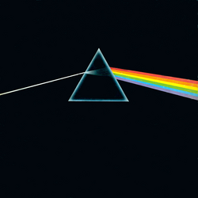

{fig-align="center"}

En la recepción de la obra de Pink Floyd en los noventa, la crítica solía aclamar el único disco de la banda con Syd Barrett *The Piper at the Gates of Dawn* y considerar obras menores, cacahuetes para el populacho, álbumes como el que nos ocupa ahora. Uno de los efectos positivos de la llegada de Internet es que el crítico de rock ha desaparecido como mediador entre la obra y el público, y todos podemos expresar nuestra opinión. Asi que podemos decir que *The Dark Side of the Moon* es una de las obras más perdurables de la era de los álbumes y del rock progresivo. Hoy he visto a una persona llevar una camiseta con la portada del disco, quizá sin saber que existe o haberlo oído nunca.

*The Dark Side of the Moon* ha de aparecer en cualquier lista de álbumes de los setenta por su carácter fundacional y por ser una obra colectiva donde cada uno realiza una aportación distintiva. Llevando al formato de canción rock lo que aprendieron en la experimentación de los discos anteriores, Pink Floyd creó el sonido de los grupos de radio FM de los ochenta. Al escucharlo, hemos de tener en cuenta que se puso a la venta en marzo de 1973: avanzaba la música de diez o veinte años después. Los cuatro miembros aportan de manera distintiva: aparte de su trabajo como batería, Nick Mason incorpora efectos de sonido, Rick Wright aporta arreglos de sintetizadores al sonido del grupo, las texturas de guitarra de David Gilmour fueron muy imitados en las siguientes décadas, y Roger Waters consigue mantener bajo control su carisma y densidad conceptual. Y no podemos olvidar el trabajo de Clare Torry como cantante de The Great Gig of the Sky, la canción más original del disco.

Es triste decirlo, pero hoy pocos recuerdan a Syd Barrett. Los que más le han recordado han sido sus compañeros de grupo (incluyendo David Gilmour). Otro día hablaremos de Syd Barret y *Wish You Were Here*. Los problemas que llevaron a Syd Barrett al ostracismo ya están apareciendo en *Brain Damage*. *The Dark Side of the Moon* puede entenderse como un álbum conceptual en torno a las experiencias de cuatro jóvenes que resultaron formar Pink Floyd.

