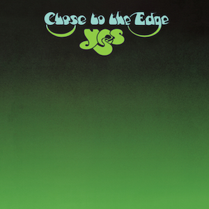

{fig-align="center"}

El quinto disco de Yes, y el segundo y último con la alineación titular: Anderson, Bruford, Howe, Squire, Wakeman y Eddie Offord de productor. Portada de Roger Dean y primera aparición del logo canónico. *Close to the Edge* es uno de esos álbumes totalmente Yes: las influencias son irreconocibles, al menos para mí. Tres temas: *Siberian Khatru* y *And You and I* en una cara, *Close to the Edge* en la segunda. La suite *Close to the Edge* está estructurada como una sonata o un concierto clásico: un movimiento rápido, uno lento y otro rápido. Esta estructura permite mostrar los registros del grupo: endiabladas cabalgadas de cuatro monstruos de su instrumento, ritmos endiablados, aparente caos y total control. Pero también uso del órgano de iglesia en un formato de canción rock y armonías vocales (Squire era tan buen cantante como Anderson, y en registros parecidos). Pero el mejor tema del disco es *And You and I*, por las guitarras acústicas del principio y por sus diversas texturas desplegadas en tan sólo diez minutos, frente a los dieciocho de la suite. Este tema está estructurado en cuatro tiempos, también lejos de la clásica estructura de canción pop. *Siberian Khatru* es de estructura más sencilla, pero muy disfrutable; en la gira del álbum abría el concierto tras el Pájaro de Fuego de Stravinsky. He mencionado antes la portada de Roger Dean. La transición de negro a verde es totalmente abstracta, fuera de este mundo, como lo son las letras, más pensadas para armonizar que para transmitir algún mensaje concreto. *Close to the Edge* es una celebración del virtuosismo musical, del arte por el arte, totalmente desconectada del mundo exterior. Esto ha sido particularmente celebrado por su público en los más de cincuenta años de vida de este disco.
