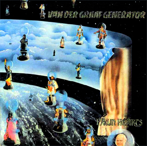
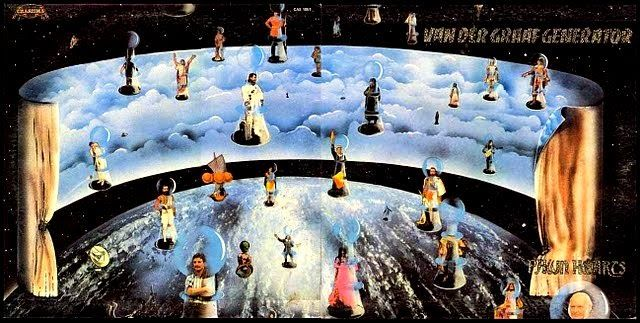
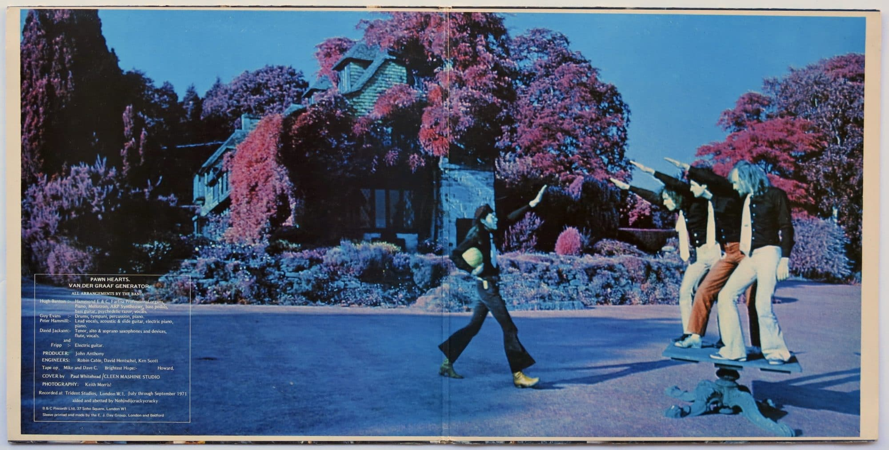

{fig-align="center"}

Cada grupo musical tiene su propia estructura, resultado del carácter y el talento de cada uno de sus miembros. Van de Graaf Generator (VdGG) es uno de los medios con los que Peter Hammill presenta la música, estructurado en torno a un claro líder con tres seguidores. Esto es lo único ordinario de VdGG: en *Pawn Hearts* su improbable formación incluye a Hammill como cantante e instrumentista (acústica y piano), Hugh Banton como organista y supliendo el bajo con pedales, Guy Evans como solvente batería y David Jackson como saxofonista (a veces tocando dos saxos a la vez) y flautista. Su música fue definida alguna vez por Hammill como un intento de equilibrar caos y control. En *Erg-Man* esta oposición entre la cacofonía y el lirismo ilustra la dualidad de toda persona humana, la capacidad de hacer el bien (Angels) pero también el mal (Killers). *Lemmings* completa la primera cara, ilustrando los impulsos suicidas de estos simpáticos roedores nórdicos. La otra cara del disco es *A Plague of Lighthouse Keepers*, una suite sobre las desventuras de un farero que ve cómo se va hundiendo un barco tras otro. Una de las metáforas tan frecuentes en Hammill.

Como en otros discos de esta primera época de VdGG, Robert Fripp interviene como músico invitado. Conjuntamente con Lindisfarne y Genesis, que en aquella época giraban con Nursery Cryme, formaban parte de una escena de rock progresivo clásicamente británica. Sobre todo en Genesis y VdGG, el blues y rock de América volvía a la metrópoli, y se sincretiza con la cultura pop y victoriana británica. En el caso de VdGG esto se articulaba en letras intensas, momentos líricos combinados con otros de terror y caos, y un toque de la science fiction británica, ilustrada por las primeras encarnaciones de Doctor Who. Pawn Hearts es la mejor producción de esa época de Hammill con VdGG.

En estos discos las portadas y los contenidos interiores son parte integrante del lore de la obra. Esa es la ventaja del LP sobre el CD o el streaming en Spotify. Esto es particularmente relevante en *Pawn Hearts*. Aquí la portada en gatefold sleeve (disco que se abre):

{width=100%}

Y la imagen del interior, no exenta de polémica (resulta ser una broma à la Monty Python):

{width=100%}

