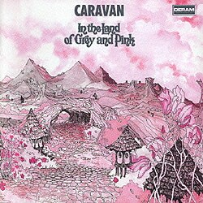
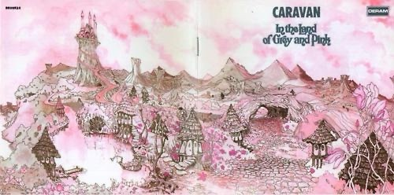
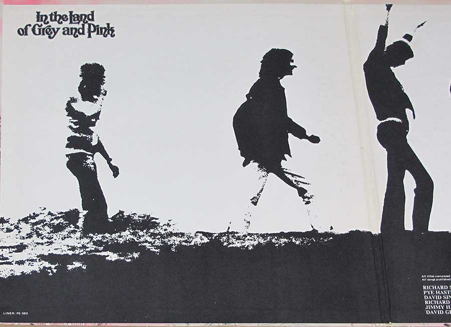

{fig-align="center"}

En los años setenta apareció una escena de bandas agrupadas en la etiqueta *Canterbury Sound*. De esa escena destacan dos bandas, o más bien dos agrupamientos de músicos en torno a Soft Machine y Caravan (de hecho, las dos bandas provienen de Wilde Flowers). También andan por ahí Robert Wyatt, al principio en Soft Machine y luego ya por su cuenta. Y Kevin Ayers.

Pero hoy toca hablar de Caravan, y de su disco más conocido, *In the Land of Grey and Pink*. En este disco, Caravan son los Pye Hastings (guitarra), Richard Coughland (batería) y los primos Richard Sinclair (bajo) y David Sinclair (teclados). La portada transmite adecuadamente la atmósfera de la música. Letras psicodélicas (sueños, hierba gris, etc.), músicos que se empeñan en complejos arreglos instrumentales, pero también en crear la canción pop perfecta. La cara B del disco la ocupa íntegramente la suite *Nine Feet Underground - Medley*. Es en gran parte instrumental, compuesta a partir de varios temas de David Sinclair (de ahí que lo de Medley). La cara A es más variada, con cuatro canciones de títulos marca de la casa: *Golf Girl*, *Winter Wine*, *Love to Love You (and Tonight Pigs Will Fly)* y *In the Land of Grey and Pink*. Son canciones pop alegres y fáciles de escuchar.

La forma de componer de Caravan en este disco es curiosa: la parte rítmica la lleva la guitarra y la batería, mientras que la melódica la tejen los primos Sinclair al bajo y teclados. Es curioso que los dos miembros fijos del grupo son los que tienen intervenciones más discretas, aunque Coughlan es un batería tipo jazz muy bueno. In the Land of Grey and Pink es música para salir a la calle a caminar de buen humor un día soleado, totalmente disfrutable 55 años después de haber sido presentada.

A beneficio de inventario, la portada completa de la versión plegable del LP:

{width=100%}

Y la imagen del interior:

{width=100%}

