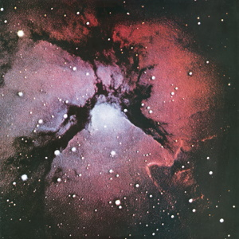

{fig-align="center"}

Entre 1969 y 1971 King Crimson publica cuatro discos y quema una de sus etapas, la alianza entre Robert Fripp y Peter Sinfield. La dinámica del grupo es de descomposición: Fripp no encuentra a un bajista y enseña a tocar el bajo a Boz Burrell, y la recepción del disco en años posteriores fue peor que la de los otros tres. Curiosamente, en la reencarnación de King Crimson de los años diez, la presencia de *Islands* es evidente, por la recuperación de Mel Collins y la voz de Jakko Jakszyk. El tema más conocido es *Formentera Lady*. En aquella época hippies anglosajones, sobre todo ingleses, descubrieron el atractivo de las Baleares. Daevid Allen vivió allí durante mucho tiempo, y Peter Sinfield encontró inspiración típica de la época:

Houses iced in whitewash guard a pale shoreline 
Cornered by the cactus and the pine 
Here I wander where sweet sage and strange herbs grow 
Down a crumpled sun-baked stony road 

La esmerada educación británica de la época en obras clásicas hace que Formentera se convierta en un escenario de La Odisea:

Lamplight glows on old guitars, the travelers strum 
Incense children dance to an Indian drum 
Here Odysseus charmed for dark Circe fell 
Still, her perfume lingers, still her spell 

*Formentera Lady* está ligado a *Sailor’s Tale*, un tema instrumental protagonizado por la guitarra de Fripp que apunta al sonido de la siguiente reencarnación de King Crimson.

Otros dos temas con letras de Sinfield son *The Letters*, un intercambio epistolar entre amante y esposa que acaba trágicamente, y *Ladies of the Road*, una canción de groupies que sería impublicable hoy. Cierran el disco el *Prelude: Song of the Gulls* seguido de *Islands*, una fusión de música clásica con los caminos que en su día abrió *Kind of Blue*.

Después de grabar *Islands*, el camino lógico habría sido que el grupo se separara y que Fripp y Sinfield siguieran su carrera por separado. Sin embargo, Fripp despidió a Peter Sinfield y al resto de miembros del grupo y se quedó con el nombre del grupo, que emergería en una nueva formación dos años después.
