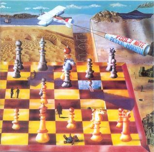

{fig-align="center"}

En 1971 Peter Hammill grabó dos discos: *Pawn Hearts* con Van der Graaf Generator (VdGG) y *Fool’s Mate* en solitario. Dos discos opuestos en planteamiento: *Pawn Hearts* tiene dos canciones largas y una suite, grabadas con los mismos músicos, y *Fool’s Mate* doce canciones cortas, grabadas con una larga lista de colaboradores, que incluyen a todos los miembros de VdGG más músicos de Lindisfarne, Robert Fripp y otros. Fue una oportunidad de vehicular temas más cortos con los músicos más adecuados para cada uno.

*Fool’s Mate* es el punto de partida de la carrera de Peter Hammill en solitario, mucho más extensa y diversa en formatos que la de VdGG. Este disco siempre me ha parecido como una caja de bombones: muchas canciones cortas, muy diferentes entre sí e interesantes por diferentes motivos. La que más ha perdurado es *Vision*. Su sonido es siempre vigente: la increíble voz de Hammill y un piano:

I have a vision of you 
Locked inside my head 
It creeps upon my mind 
And warms me in my bed 
A vision shimmering, shifting 
Moving in false firelight 
A vision of a vision 
Protecting me from fear at night 
 
As the seasons roll on 
And my love stays strong 

Las canciones *Child* y *the Birds* tienen un sabor parecido, más complejas musicalmente y de gran delicadeza. Pero hay otras cosas: *Candle* es la canción de Hammill con la mandolina de Ray Jackson, y temas como *Imperial Zeppelin* o *Vikings* nos llevan a otras épocas durante unos minutos. En *Vikings* o *The Birds* Robert Fripp entra partes de guitarra de gran belleza. Como curiosidad, el sonido de al final de la última canción (*I Once Wrote Some Poems*) es el mismo con el que empieza la primera (*Imperial Zeppelin*), así que el disco se cierra en círculo.

El denominador común de todo el disco es la voz de Hammill, capaz de tomar gran variedad de registros, del grave al falsete, de la delicadeza al grito descarnado.

