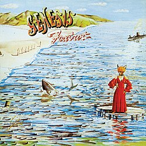
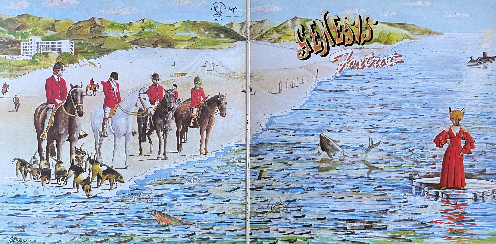
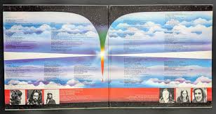

{fig-align="center"}

*Foxtrot* tiene dos temas clave de la historia de Genesis y del rock progresivo. En *Watcher of the Skies*, Tony Banks lleva el mellotron a su máxima expresión como instrumento solista. Los acordes de entrada nos llevan un ambiente ominoso, donde el protagonista epónimo  contempla desolado la Tierra abandonada por los humanos, convertidos en una entidad unificada viajando en el espacio exterior hacia un futuro incierto:

From life alone to life as one 
Think not now your journey's done 
For though your ship be sturdy 
No mercy has the sea 
Will you survive on the ocean of being? 
Come ancient children, hear what I say 
This is my parting counsel for you on your way 

El segundo tema, *Supper’s Ready*, ocupa casi toda la segunda cara del disco, compartida con *Horizons*, una breve pieza en acústica de Steve Hackett basada en un tema de Bach. Como todo el mundo debería saber, *Supper’s Ready* es la canción más larga de Genesis, una suite de unos 23 minutos. Tiene una entrada lírica, que nos muestra una pareja viendo la tele a la hora de cenar. Algo sucede con ellos y entran en una aventura lisérgica similar a la de la Alicia de Lewis Carroll. La suite acaba cantando el triunfo del bien sobre el mal:

There's an angel standing in the sun, and he's crying with a loud voice, 
"This is the supper of the mighty one", 
Lord of Lords, 
King of Kings, 
Has returned to lead his children home, 
To take them to the new Jerusalem. 

Los otros temas del disco no han tenido tanta fama, pero también son muy buenos (el disco es excelente de la primera a la última nota). *Time Table* and *Can Utility and the Coastliners* siguen con el sonido de *Nursery Cryme*, propio de la época inglesa de Genesis. Get’em Out by Friday es otra de las estampas de la vida inglesa de los setenta, como *Harold the Barrel* y *The Battle of Epping Forest*. Muestra un episodio de especulación urbanística de la época, que es traspuesta a un entonces lejano 2012, donde Genetic Control restringe la estatura de los humanoides para poder hacer más pisos en el mismo volumen de edificación.

La portada completa tiene una parte izquierda más rica que la derecha, incluyendo una extraña partida de caza y la portada de Nursery Cryme. Esto sugiere que ambos discos transcurren en el mismo universo.

{width=100%}

Guardemos para la posteridad también la imagen del interior:

{width=100%}

