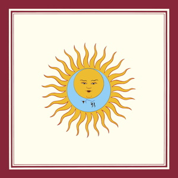

{fig-align="center"}

*Islands* resultó ser el final de la primera encarnación de King Crimson, al llegar a su fin la relación entre Robert Fripp y el letrista Peter Sinfield. Fripp se queda con el nombre del grupo y a principios de 1973 reaparece con nuevos miembros y un planteamiento musical totalmente distinto.

Esta versión de King Crimson tiene cinco miembros. Puede entenderse como la superposición de un power trío de guitarra (Fripp), bajo y voz (John Wetton) y batería (Bill Bruford), al que se unen un percusionista (Jamie Muir) y un violinista (David Cross). Peter Sinfield es reemplazado como letrista por Richard Palmer-James, pero en un rol mucho más secundario.

El disco se abre y se cierra con la primera y segunda parte de *Larks’ Tongues in Aspic*. La parte I está escrita en forma de suite, y destaca la tensión dialéctica entre la percusión de Jamie Muir y el violín de David Cross: improvisación y orden, caos y control. La síntesis es la guitarra de Fripp. El oyente ya puede apreciar la clara superioridad de la sección rítmica Wetton-Bruford sobre las de la anterior época del grupo. La hipnótica *The Talking Drum* nos prepara para la parte II, un riff de guitarra de Fripp próximo al heavy metal, que un crítico musical de la época describió adecuadamente como “una montaña rusa de ira y control”.

Entre las dos secciones instrumentales tenemos tres canciones. *Book of Saturday* es la versión más lírica de esta variante de King Crimson. *Exiles* explora el tema de empezar una nueva etapa, en este sentido está emparentada con *Solsbury Hill* de Peter Gabriel. La mejor de las tres es *Easy Money*, una crítica al materialismo (estamos en 1973): las versiones remasterizadas nos permiten apreciar el gran trabajo de Jamie Muir en este tema.

*Larks’ Tongues in Aspic* es el inicio de la mejor época de King Crimson, en la que se establecen las reglas del juego: un sonido más bronco que el de la época *hippie* anterior, la tensión dialéctica entre caos y control propia del género, y la creciente importancia de la improvisación, de la que tenemos testimonio en las grabaciones de los conciertos de la época.

