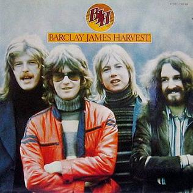

{fig-align="center"}

*Everyone is Everybody Else* inaugura una época en la carrera de Barclay James Harvest. Es su primer álbum con Polydor, después de haber abandonado el sello Harvest, al que al parecer contribuyeron a dar nombre. El disco está producido por Roger Bain, que antes había producido a Black Sabbath, y es el primero en que no usan orquesta en ninguna de sus canciones.

El primer y último tema, *Child of the Universe* y *For No One* se incorporaron a su repertorio permanente. Los dos son temas de John Lees, con letras de carácter antibelicista y pacifista. Recuperaron el tema de Les Holroyd *Crazy City* para su álbum en directo de 1988 Glasnost. Estos tres últimos temas también aparecen en el *Barclay James Harvest Live* de 1974, junto a *Negative Earth*, *Paper Wings* y *The 1974 Mining Disaster*. Las versiones en directo son más potentes que las de estudio, probando la calidad musical de la banda y su adaptación al formato de banda de rock clásica, con tres de los cuatro miembros capaces de cantar con solvencia y el mellotron de Wolly Wolstenholme. A esto hay que añadir la calidad instrumental de John Lees en la guitarra eléctrica, el bajo de Les Holroyd y la batería de Mel Pritchard, que empieza a brillar a gran altura en esta etapa.

El tema The *1974 Mining Disaster* inaugura un tipo de escritura por parte de John Lees que se repetiría más adelante, el de incorporar referencias a otros músicos por los que tiene respeto o con los que se les comparó. El estribillo de este tema está basado en el *New York Mining Disaster 1941* de los primeros Bee Gees, y añade referencias a David Bowie como “a major out of space” o “the man who sold the world away”. El tema está basado en la huelga minera de 1974 en el Reino Unido, que acabaría con el gobierno conservador.

Las canciones centrales de la cara dos del disco también están muy bien. *See Me See You* tiene buenas armonías vocales y *Poor Boy Blues* y *Mill Boys* es una maravilla: dos canciones acústicas de Les Holroyd y John Lees que en realidad son una canción, y que son la mejor entrada para *For No One*.

Para saber más: <https://www.bjharvest.co.uk/eiee.htm>

