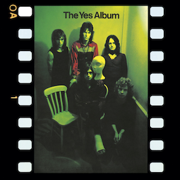

{fig-align="center"}

Con *The Yes Album*, Yes experimenta un crecimiento sustancial respecto a sus dos primeros discos. Dejan de hacer versiones, y el nuevo material gana mucho en complejidad e interés. Un factor clave es el reemplazo de Peter Banks for Steve Howe. Howe es un guitarrista mucho más técnico, e introdujo muchos nuevos sonidos al grupo de la manera que se podía en la época: usando múltiples variantes de la guitarra, desde la slide guitar hasta la guitarra portuguesa. Uno de los temas del álbum, *The Clap*, es un solo de acústica de Howe grabado en directo.

El resto de temas son de gran calidad, muchos de ellos han aparecido en los *setlists* en directo en la larga carrera del grupo. El tema menos recordado es *A Venture*, también el más sencillo de la banda. Vamos con el resto por orden. *Yours is no Disgrace* representa la mejor versión de Yes: el grupo sonando como un todo, destacando el personalísimo sonido de Squire y Howe, así como las armonías vocales de ellos dos con Jon Anderson. *Starship Trooper* es la unión de tres temas, de los que destaca la tercera, compuesta por Howe y que les daría mucho rendimiento en directo. *I’ve Seen All Good People* es un tema en dos partes, *Your Move* y *All Good People*. Además de las armonías vocales y el uso de instrumentos acústicos por Howe, el tema cuenta con un final grandioso con órgano Hammond, más patente en la versión en estudio que en directo. *Perpetual Change* es el tema más complejo del disco, con un gran trabajo de batería de Bill Bruford y el uso de contrapunto. La versión del *Yessongs* con solo de batería de Bill Bruford es testimonio de unas habilidades acrobáticas que pocos grupos han igualado.

*The Yes Album* es un salto de calidad en el sonido de Yes, que es ya un grupo que compone su propio sonido. La diferencia de sonido de este disco con los que vinieron poco después es el órgano Hammond de Tony Kaye, que da un sonido muy especial que no se repetiría en los siguientes discos.

