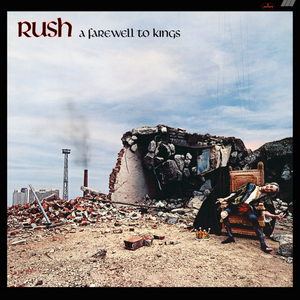

{fig-align="center"}

En los setenta y ochenta, Rush organizó su carrera en ciclos de cuatro discos en estudio y un doble en directo. Grabado justo después del directo *All the World’s a Stage*, *A Farewell to Kings* inicia un ciclo y representa una progresión hacia un nuevo estilo y un nuevo sonido. En comparación con su etapa anterior, Rush introduce muchas más texturas de sonido con guitarra acústica, sintetizadores y guitarras de doce cuerdas. Todo esto se pone sobre la mesa en los dos primeros temas, *A Farewell to Kings* y *Xanadu*. El primer tema tiene una entrada de acústica espectacular, y es una canción muy potente y variada en temas. *Xanadu* tiene una introducción instrumental de cinco minutos y una letra basada en el poema *Kubla Kahn* de Samuel Taylor Coleridge, uno de los poemas románticos ingleses más celebrados. De hecho, la letra parafrasea el poema de Coleridge. Anda algo perdida por ahí, pero Dream Theater hizo una versión muy buena de al menos la entrada de *Xanadu*, con un sonido mucho más poderoso. 

En el siglo XX, los mundos aparte tan queridos al romanticismo se fueron al espacio exterior con la ciencia ficción. *Cygnus X-1 Book I: The Voyage* es la primera parte de la historia de la Rocinante, una nave espacial que se lanza de cabeza a un agujero negro (la continuación sería una suite large en *Hemispheres*). A diferencia de *2112*, aquí Rush optó por dos temas de diez minutos en vez de una suite de veinte minutos-

Yendo a los temas cortos, tenemos *Closer to the Heart*, una de las canciones más célebres de Rus, un himno con letra emblemática que interpretaron en sus conciertos desde entonces. Cierran el disco dos temas cortos menores, *Madrigal* y *Cinderella Man*, en los que el grupo juega con los sintetizadores y explora nuevos sonidos más allá del power trio.

*A Farewell to Kings* sienta las bases para el Rush del futuro, un power trío de virtuosos con inquietudes intelectuales, con un estilo muy personal que evoluciona a medida que lo hace la tecnología.

