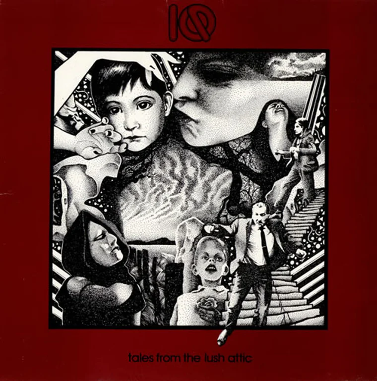

{fig-align="center"}

Barcelona, 1986. Hacía poco que Marillion había venido en la gira del *Fugazi* y acababa de salir el *Misplaced Childhood*. Y no se sabe muy bien cómo, aparece un disco de unos tíos que se llaman IQ, de título *Tales from the Lush Attic*. La portada que llegó aquí fue la de borde rojo, enmarcando el extraño dibujo puntillista del cantante. En la época Peter Nicholls llevaba pintada la cara al estilo Peter Gabriel con Genesis, y Mike Holmes tenía un peinado difícil de olvidar. *Tales from the Lush Attic* era su primer disco, había salido en el mismo año que *Script for a Jester’s Tear* de Marillion y fue una de las obras fundacionales de la segunda ola del rock progresivo.

Lo primero que escuchas del disco es *The Last Human Gateway*, una suite que ocupa casi toda la primera cara. La composición sigue la plantilla de *Supper’s Ready*: inicio a medio tiempo, diversas partes con diferentes ambientes acabando en grand finale. Completa la primera cara *Through the Corridors*, con una espectacular línea de guitarra de Mike Holmes. La segunda cara tiene dos temas: *Awake and Nervous* y *The Enemy Smacks*. Con la distancia del tiempo, *The Enemy Smacks* es la mejor canción del disco. Con una letra que te explica lo que sucede cuando caes en el pozo sin fondo de la droga inyectada, tiene tantas o más ideas musicales que la *The Last Human Gateway*. Separa las dos canciones una breve pieza de piano de Martin Orford titulada *My Baby Treats Me Right 'Cos I'm A Hard Lovin' Man All Night Long*.

La carrera de IQ ha sido muy larga, han logrado progresar y seguir a flote (no todos pudieron) y su sonido es ahora mucho más elaborado. Pero su primer disco tuvo el mérito de mostrarnos que el género del rock progresivo era todavía viable. IQ eran deudores de Genesis con Gabriel, pero su aproximación a la música (lo que ahora se llamaría si aura) era decididamente contemporánea.
