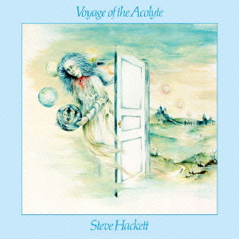

{fig-align="center"}

El primer disco en solitario de Steve Hackett, compuesto durante la gira de *The Lamb Lies down on Broadway* y publicado antes de A *Trick of the Tail*. Cuenta como colaboradores con sus compañeros de grupo Mike Rutherford y Phil Collins, su hermano John Hackett a la flauta, que seguiría con él en sus otros discos en solitario. También aparece Sally Oldfield cantando un par de temas.

El disco tiene un elemento conceptual, pues las canciones están relacionadas con las cartas del tarot. Como suele pasar en este los discos en solitario, Hackett aprovecha para mostrar material que no tendría mucha salida con el Genesis de Peter Gabriel. Hay ambientes con acústica y flauta, estupendos solos de guitarra, fragmentos de guitarra grabados al revés en un par de temas, y un tema con aires crimsonianos (*The Tower Struck Down*). Es difícil de identificar los gritos de la multitud que suena al final de este tema, pero me temo lo peor. 

Mis temas favoritos de este disco son *Ace of Wands*, un tema instrumental muy dinámico con muchos paisajes sonoros en muy poco tiempo, y *Shadow of the Hierophant*. Este tema tiene un final claramente inspirado en el *Bolero* de Ravel, con una sección de guitarra eléctrica excelente. También destaca *Star of Sirius*, la canción que canta Phil Collins, y la segunda parte de *Hands of the Priestess*, en el que destacan los dos hermanos Hackett a la acústica y la flauta.

Este disco sería el primero de una larga serie de discos de Steve Hackett, muchos de ellos excelentes, y lo consagró como un guitarrista melódico de muchos registros, tanto en guitarra eléctrica como acústica. De hecho, pocos músicos del género han igualado los pasajes de guitarra acústica de Steve Hackett.
