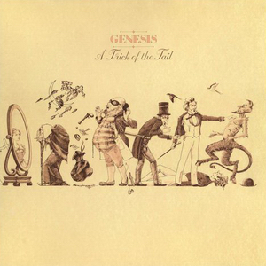
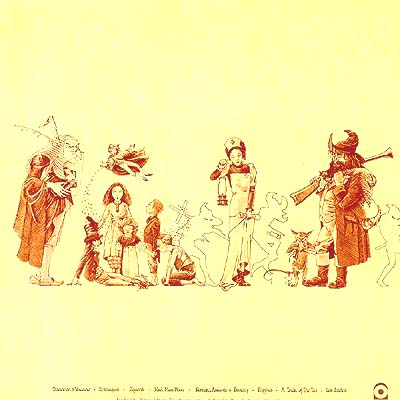

{fig-align="center"}

*A Trick of the Tail* es la prueba de que Genesis es un grupo extraordinario. Venían de perder a Peter Gabriel después de *The Lamb Lies Down on Broadway* (LDWB), y ni siquiera ellos estaban seguros de que el grupo sobreviviría. Podemos entender *Voyage of the Acolyte* como un intento de Steve Hackett de continuar su carrera después de una probable disolución de Genesis. Les salvó el talento colectivo del grupo: los cuatro miembros eran capaces de componer su propia música (aunque Tony Banks es el que más se resiente cuando no trabaja con los otros miembros del grupo) y el grupo se puso a componer nuevo material en torno a Tony Banks. Que Phil Collins fuera el nuevo cantante no es algo tan sorprendente como podría parecer: ya cantó *For Absent Friends* en el *Nursery Cryme* y* More Fool Me* en *Selling England by the Pound* (SEBP).

El disco es excepcional desde la primera hasta la última nota. Algunas canciones vuelven al sonido de SEBP: *Robbery, Assault and Battery* y *Entangled* recuerdan a diferentes partes de *Cinema Show*. Las partes de guitarra de *Dance on a Volcano* y *Ripples* recuerdan a algunos pasajes de LDWB. *Squonk* está inspirado en una criatura del folklore de Pennsylvania, que se disuelve en lágrimas cuando es capturada. *Mad Man Moon* y *A Trick of the Tail* transmiten la visión desencantada del mundo de Tony Banks, que no es precisamente la alegría de la huerta. *Los Endos* es un tema instrumental a partir de *Dance on a Volcano* y *Squonk*, pensado para acabar los conciertos.

La portada transmite muy bien el *lore* del disco. En un fondo amarillo pálido, desfilan diversos personajes asociados a cada una de las canciones del disco. Con su estética, muestra su vinculación con la cultura inglesa de la época victoriana. La portada transmite cómo *A Trick of the Tail* supone, entre otras cosas, un regreso a las raíces netamente inglesas de Genesis.

{fig-align="center"}
