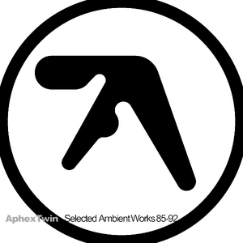

{fig-align="center"}

Al empezar un proyecto como este, uno fija unas reglas del juego y cree que será persistente aplicándolas. Pero después pasan cosas, no necesariamente importantes, y los planes cambian. Mirando Instagram vi un reel de un italiano (\@indiebar_it) recomendando diez discos de techno, y el primero de ellos era *Selected Ambient Works 85-92*, presentado con un fragmento de *Pulsewidth*. Es posible que otros discos que salieron en ese reel vayan apareciendo por aquí. Además de ser un inventario de clásicos del progresivo, este blog servirá para no olvidar nuevas adquisiciones que vayamos encontrando en el camino.

Leyendo por ahí, supe que este disco es del género Ambient. Uno venía de oír cosas de Tangerine Dream o Soundscapes de Fripp, que son una versión del Ambient de pasajes largos y desprovisto de ritmo y armonía. Aphex Twin ya se acerca al Ambient con la tecnología más desarrollada, de modo que puede componer música él solo con un ordenador. Este disco tiene ritmos y a veces melodías, pero sigue las premisas del Ambient: puede ser escuchado desde diversos niveles, de manera inconsciente desde el hemisferio derecho, o fijándose en las diversas capas de sonidos que va superponiendo. Este disco funciona muy bien en Spotify, y se disfruta mucho saliendo a pasear llevándolo en cascos con reducción de sonido.

Richard David James nació en 1971, y su lenguaje ha sido el de la música electrónica desde pequeño: unos miran al pasado, otros miran al futuro. Algunos de los temas que aparecen en este disco son de 1985, cuando el autor tenía catorce años. Dicen que las pistas de sonido que utilizó para componer eran de baja calidad, pues estaban grabadas en cassette. Sin embargo, este es uno de esos discos que apreciarán los entusiastas del sonido limpio.

