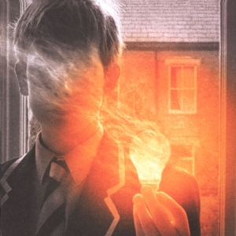

{fig-align="center"}

*Lightbulb Sun* es el sexto disco de Porcupine Tree (PT), y el que le hace ser conocido por el mainstream del rock progresivo en el final del siglo XX. Este disco se puede entender como el resultado de la experimentación desarrollada en discos anteriores de PT, y de otros proyectos que había ido desarrollando Steven Wilson durante la década anterior. De hecho, PT empezó siendo un pastiche del típico grupo de rock psicodélico, y fue evolucionando hacia una banda de rock clásica.

Mis canciones favoritas del disco son *The rest will flow* y *Where we would be*. En la Wikipedia, aprendemos que son dos de las canciones de este disco que tratan del proceso de ruptura de una pareja. Otras son *Shesmovedon*, *How is your life today?*, *Hatesong* y *Feel so low*. Las letras desarrollando temas personales eran muy raras en los grupos del primer progresivo (se me ocurre ahora *More fool me* de Genesis), y serían cada vez más habituales en grupos como Marillion. De los otros temas, destaca la incorporación del discurso final del líder de Heaven 's Gate en *Last chance to evacuate Planet Earth before it is recycled*.

Musicalmente el disco tiene muchas influencias de toda clase de grupos de los años sesenta y setenta, pero también de música electrónica y experimental y el heavy metal. Mientras que la primera ola de grupos de rock progresivo tenían básicamente el blues y el rock and roll como referencia, Steven Wilson tiene a su disposición toda una tradición musical, su capacidad para integrar estas tradiciones ha sido excepcional. El resultado es una música que no recrea a los grupos de los sesenta, sino que asimila una tradición que se fue consolidando durante treinta años alrededor del formato de álbum.

