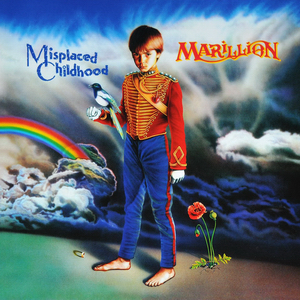

{fig-align="center"}

Después de la explosión del punk en el Reino Unido y Estados Unidos a mediados de los setenta parecía que el progresivo se había convertido en un capítulo cerrado de la historia del rock británico. Grupos como Yes o Genesis se habían reinventado, y los excesos instrumentales de los primeros setenta eran denostados por la crítica, siempre buscando la autenticidad y la conexión con el espíritu del tiempo. En esto la crítica seguía a la industria: el potencial comercial del punk era mejor que el rock de los primeros setenta. Contra todo pronóstico, a mediados de los ochenta empieza a resurgir el progresivo, y es Marillion el grupo más reconocido de esa oleada de neo rock progresivo.

*Misplaced Childhood* es el disco que les consagró. La guitarra de Steve Rothery se iba acercando a la paleta de sonidos de David Gilmour (Pink Floyd), y Fish era un cantante con un carisma escénico proveniente tanto de Peter Gabriel como de Phil Collins. Es un disco conceptual, con dos piezas de música seguidas para cada una de las caras del LP. Es el clásico disco que a la que lo escuchas no puedes dejar de escucharlo hasta el final, y que más tarde dejas de escucharlo durante mucho tiempo porque te lo sabes de memoria.

El concepto y las letras del álbum giran en torno a la vida de Fish hasta el momento. Es mucho más popular la primera parte. *Kayleigh* es la canción para la novia con la que no supiste (o supisteis) seguir, y *Lavender* un recuerdo para las “novias” que tenías de chaval. También aparece el Hearts of Midlothian, el equipo de Edimburgo. Como se ve, bien lejos del escapismo a lugares imaginarios de algunos grupos de la primera ola del progresivo.

*Misplaced Childhood* significó para Marillion la fama, y también una presión difícil de soportar para un grupo de chavales de Escocia para repetir el éxito en el siguiente álbum. Esa y no otra fue el tema del siguiente álbum de Marillion, *Clutching at Straws*, que supuso el final de la primera etapa del grupo.

