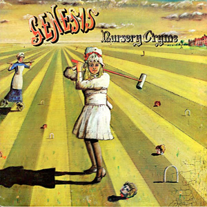

{fig-align="center"}

*Nursery Cryme* es el primero de los discos de la edad de oro de Genesis, que finaliza con *Wind and Wuthering* y el disco en directo *Seconds Out*. Como es bien sabido, es el primer disco en que participan Phil Collins y el hilo conductor de la edad de oro del sonido de Genesis, el guitarrista Steve Hackett.

El disco tiene dos tipos de canciones. Por un lado, las épicas *The Musical Box*, *The Return of the Giant Hogweed* y *The Fountain of Salmacis*. Temas largos, con arreglos de gran complejidad que casi no caben en las ocho pistas con que grabaron el disco. Por otro, canciones más cortas que retienen el sonido folk del disco anterior, *Trespass*: *For Absent Friends*, *Harlequin*, y ya con arreglos más complejos *Harold the Barrel* y *Seven Stones*. *Harold the Barrel* inaugura una línea de canciones satíricas, que continuaría en los dos discos siguientes. Y *For Absent Friends* es la primera canción que canta Phil Collins en Genesis.

*Nursery Cryme* representa un gran salto cualitativo en las capacidades musicales de Genesis. Steve Hackett aporta una gran versatilidad, tanto en guitarra eléctrica como acústica, aunque el mayor salto de calidad fue la entrada de Phil Collins como batería. La gente que conoce al Collins de la banda sonora de *Tarzan* no se puede imaginar (y posiblemente, en muchos casos no puede apreciar) que ha sido uno de los grandes baterías del rock.

La variedad musical del disco viene integrada por las letras de Peter Gabriel. *Nursery Cryme* puede considerarse como una de las últimas producciones culturales de la Inglaterra victoriana. La contención emocional de *For Absent Friends*, el gusto por los escándalos de *Harold the Barrel*, la esmerada educación clásica que permite escribir *The Fountain of Salmacis*. Y la magistral traslación del género de terror anglosajón del siglo XIX al rock que es The Musical Box, la canción que abre el disco. Una canción escrita en un momento de transición entre *Trespass* y *Nursery Cryme*, que acabaría siendo uno de los clásicos del grupo.

