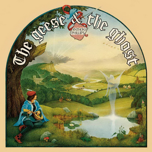

{fig-align="center"}

Pocos saben hoy en día que en los dos primeros discos de Genesis el guitarrista era Anthony Phillips. Después de grabar *Trespass*, Phillips dejó el grupo, fundamentalmente por su miedo escénico, incompatible con el frenético ritmo de shows en directo de la primera etapa de Genesis. Ya fuera del grupo, pasó cuatro años estudiando guitarra y piano, y poco a poco fue componiendo material para un disco, conjuntamente con Mike Rutherford. Lo que sería *The Geese & the Ghost* se grabó entre 1974 y 1976, y se publicó finalmente en noviembre de 1977.

El resultado es un disco irrepetible, de arreglos muy complejos y de grabación decididamente analógica: además de una orquesta, en los créditos aparecen diecinueve músicos. Tiene dos canciones interpretados por Phil Collins (*Which Way the Wind Blows*, *God If I Saw Her Now* con Vivienne McAuliffe) y otra cantada por el propio Anthony Phillips (*Collections*). *Collections* es la canción que inspiró el nombre de este blog. Luego tiene dos suites, *Henry: Portraits from Tudor Times* y *The Geese and the Ghost*. Son dos piezas de estructura clásica interpretadas con instrumentos tradicionales y eléctricos, que nos llevan a la Inglaterra victoriana más lírica y campestre. Es la cara soleada y alegre de la Inglaterra de *Nursery Cryme*.

*The Geese & The Ghost* es un disco único en la carrera de Anthony Phillips, por el tiempo que le llevó grabarlo y componerlo, y porque seguramente fue el terreno en el que aprendió los fundamentos para su carrera musical posterior. También aparecen aspectos especiales de la idiosincrasia de Phillips: la maestría en titular canciones (véanse los títulos de los fragmentos de las dos suites) y la colaboración del ilustrador Peter Cross en las portadas. Las portadas de las versiones en vinilo de los discos de Phillips son pequeñas obras de arte, que el tiempo y las sucesivas reformas y traslados se llevaron por delante.
