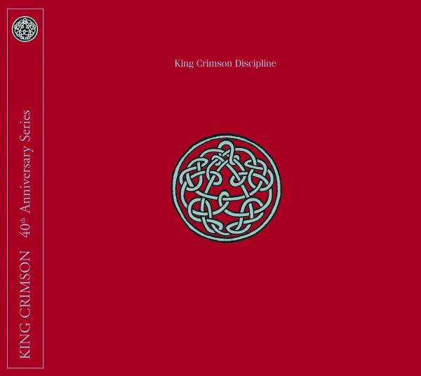

{fig-align="center"}

La segunda encarnación de King Crimson se disolvió en 1974, después de publicar *Red*. Siete años después Robert Fripp reactiva la banda renombrando el grupo *Discipline*. El nuevo King Crimson es un cuarteto con dos miembros del antiguo King Crimson, Robert Fripp y Bill Bruford y dos nuevos miembros: Adrian Belew y Tony Levin. Los dos nuevos miembros tenían una larga carrera de músicos de sesión. Tony Levin es conocido sobre todo por su colaboración con Peter Gabriel, y Adrian Belew había trabajado con Zappa, Bowie y Talking Heads.

El nuevo King Crimson viene marcado por la personalidad de Adrian Belew, el primer *front man* en la historia del grupo. Obsesionado con sacar a la guitarra sonidos que sólo él puede tocar, y capaz de cantar con una melodía y tocar a la vez otra diferente a la guitarra, Belew complementa la personalidad y el estilo de Fripp, obteniendo una síntesis a partir de poner dos estilos totalmente contrarios juntos. Bruford sigue siendo Bruford, en esta época con batería electrónica, los Simmons Drums hexagonales. Finalmente, Tony Levin contribuye con el Chapman Stick al sonido del grupo en esta nueva época.

La nueva encarnación de King Crimson es muy distinta de las anteriores. Su sonido incorpora el sintetizador, tocado a través de guitarras en *The Sheltering Sky*, así como secuencias rítmicas complejas, a veces incorporando batería electrónica. En algunos temas en directo, Belew y Bruford tocaban la batería juntos. La superposición de contrarios de Belew y Fripp se traslada a la música. *Indiscipline* aparece como un tema caótico y *Discipline* como el perfecto orden. *Thela Hun Ginjeet* y *Elephant Talk* están cerca del primer polo, *Frame by Frame* más cerca del segundo. *The Sheltering Sky* y *Matte Kudasai* son temas cercanos al *ambient*, una expresión de la música de Fripp que evolucionaría en los *Soundscapes*.

