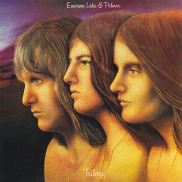

{fig-align="center"}

Emerson, Lake & Palmer (ELP) fue la expresión más exitosa de la fórmula del supergrupo. Keith Emerson venía de The Nice, Greg Lake de King Crimson y Carl Palmer de Atomic Rooster. *Trilogy* es el tercer disco del grupo, y es una muy buena introducción a su sonido. Muchas de las composiciones del grupo son complejos arreglos de teclado, batería y bajo, a veces mirando al hard rock, otras veces a la música clásica.

*The Endless Enigma* y *Trilogy* tienen una estructura en tres partes propia de la música clásica. *The Endless Enigma* tiene momentos de piano muy buenos en los movimientos primero y tercero. El segundo movimiento es una fuga tocada por Emerson y Lake. El tema que cierra el disco, *Abbadon’s Bolero*, está claramente inspirado en la estructura repetitiva del Bolero de Ravel (el King Crimson de Lake había hecho en directo una versión del Marte de los planetas de Holst, que tiene la misma estructura repetitiva de este tema). Estos temas presentan la cara de ELP más relacionada con la música clásica.

*Hoedown* es uno de los temas de lucimiento de Emerson (como la *Fanfare for the Common Man*) que hicieron muy popular al grupo, mientras que *The Sheriff* presenta el lado *tongue-in-cheek* que siempre tuvo ELP, notoriamente ausente en grupos como Yes o Genesis. *Living Sin* nos ilustra sobre el a veces peligroso mundo de las groupies, un fenómeno muy de los setenta, hoy impensable. *From the Beginning* es un tema de Lake con acústica, no tan bueno como el del primer disco pero muy notable.

*Trilogy* es conocido como uno de los discos más complejos musicalmente de ELP, en el que usaron más extensivamente la técnica de la sobregrabación *(overdub)*. Casi no tocaron estos temas en directo, excepto *Hoedown*.

