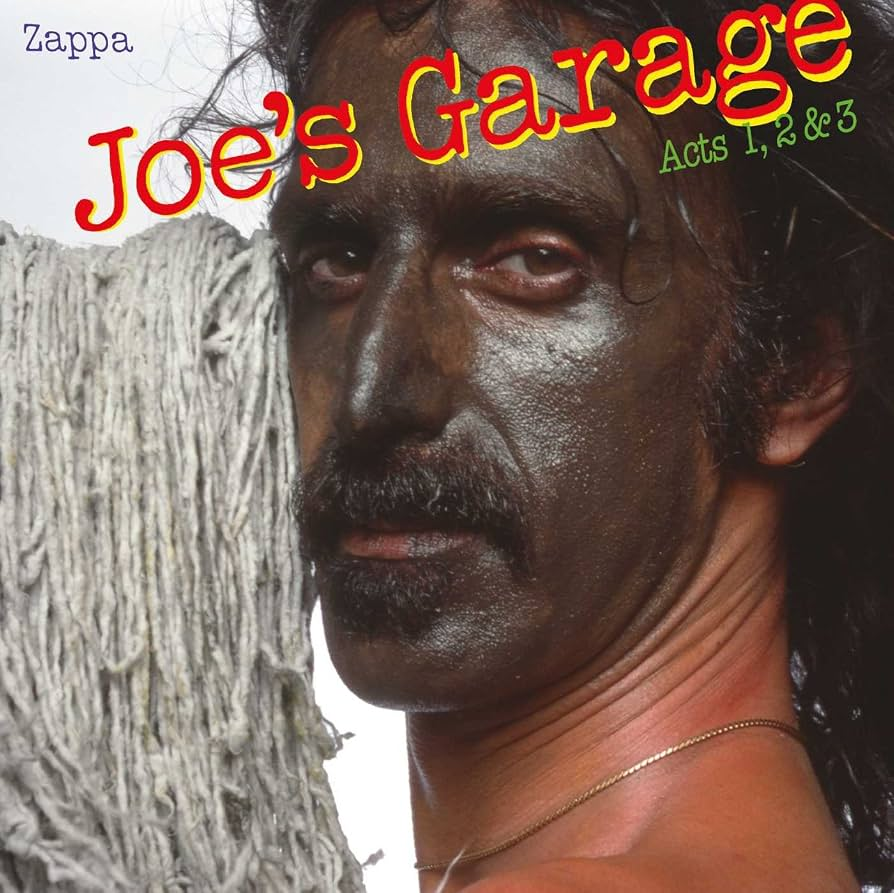

{fig-align="center"}

Una de las acusaciones recurrentes al así llamado rock progresivo es la falta de sentido del humor. Aunque es cierto que no siempre vamos a estar de broma, sí que es verdad que la actitud de muchas bandas de rock progresivo es bastante indulgente consigo mismo: los ejemplos más claros son Yes o King Crimson (aunque en el caso de Robert Fripp hay matices: véase los vídeos que presenta periódicamente con su improbable esposa Toyah Willcox, una persona con mucho sentido del humor). En otros grupos la cosa funciona según el carácter: no le podemos pedir mucho a Tony Banks, pero Phil Collins es un showman nato que frecuentemente se ríe de sí mismo.

Si alguien ha aunado el humor con el talento musical y la autoexigencia musical ha sido Frank Zappa, y uno de los mejores ejemplos es *Joe’s Garage*. En este triple álbum hay canciones dedicadas a las enfermedades venéreas, se cantan las hazañas de las *groupies* que al parecer se aproximaban a grupos como Toto y se hace burla de la Cienciología con una *Church of Appliantology*. Joe, el protagonista, da todo su dinero a esta iglesia y acaba en una orgía con electrodomésticos. Otro tema de Joe’s Garage es el poder transgresor de la música: el protagonista es perseguido por una figura autoritaria, el *Central Scrutinizer*, y tras destruir los electrodomésticos al hacer una lluvia dorada sobre ellos, es duramente castigado. Joe acaba disfrutando de la música en su imaginación. *Watermelon in Easter Hay*, la música que sólo está en la mente de Joe, es el solo de guitarra más célebre de Zappa, y uno de los mejores de la historia del rock.

*Joe’s Garage* es una prueba de cómo el humor inteligente resulta mucho más complejo que la tragedia o el drama: Aristófanes es más difícil de leer que Sófocles, Eurípides o Esquilo. Las letras de Zappa son difíciles de interpretar, y muchas veces utiliza expresiones propias, como *plooking*, *weenie* o *Cosmic Utensil*. Y escuchando Joe’s Garage en 2026, vemos cómo finalmente el Central Scrutinizer se salió con la suya, pues la música ha dejado de ser transgresora. Letras como las de este disco serían imposibles de publicar hoy en día, y podemos decir que Zappa se libra de ser cancelado debido su escasa repercusión entre los prescriptores culturales.

