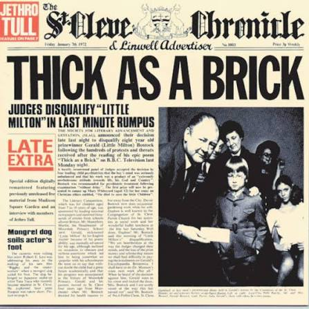
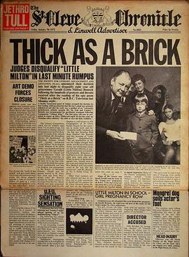

{fig-align="center"}

La motivación para este disco viene de la recepción de *Aqualung*, el disco anterior del grupo y uno de los más conocidos de Jethro Tull. Para todo el mundo menos para Jethro Tull, *Aqualung* es un disco conceptual. Así que Ian Anderson pensó que si querían un disco conceptual tendrían un disco conceptual, y se propuso escribir el disco conceptual más conceptual de todos los tiempos. Todo el disco es una sola canción, separada en dos partes por un efecto de viento, debido a las servidumbres de los formatos de la época (casete y disco de vinilo). La letra está compuesta por el talento precoz de Gerald Bostock, un prodigio de ocho años de edad conocido como "Little Milton". El *packaging* del disco era un ejemplar completo del diario regional británico *St. Cleve Chronicle & Linwell Advertiser*. En la portada aparece Gerald, al que se le ha retirado un premio por su poema al soltar un taco en una entrevista en televisión. En la página dos se le acusa de haber dejado embarazada a una chica de catorce años, y el poema —esto es, la letra del disco— se reproduce en la página siete. Más adelante, se nos informa que el grupo Jethro Tull está considerando grabar una versión musicoal del poema. Mucha gente se creyó esto al pie de la letra, y algunos piensan que efectivamente Gerald Bostock existió realmente y fue el letrista del disco.

{fig-align="center"}

Musicalmente hablando, el disco muestra las habilidades del grupo para la composición y la interpretación, tanto en formato acústico como eléctrico. Es un ejemplo de virtuosismo técnico al servicio de la expresión musical, y hace patente el estilo propio del grupo, inspirado en el *blues*, el *rock* y el *folk*. El líder del grupo, Ian Anderson, brilla en las partes vocales y de flauta, y en gran medida este disco es una muestra de su universo personal y su talento creativo. Es muy recomendable para aquellos que en pleno siglo XXI quieran acercarse a este grupo.
