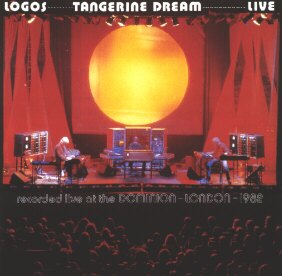

{fig-align="center"}

Incluir *Logos Live* como el primer disco de Tangerine Dream (TD) en esta selección es una decisión heterodoxa. Los discos de TD más apreciados son los de los primeros setenta, de carácter más experimental y a medio camino entre el krautrock y la exploración de las posibilidades del sintetizador. El TD de los ochenta combina los paisajes sonoros, ritmos elaborados con secuenciadores y fragmentos más melódicos. El TD de los ochenta es más accesible que el de los setenta, en un patrón bien conocido en otros grupos. Puedes considerar que en esta etapa se están recogiendo los frutos de la experimentación de la etapa anterior, o bien que estás haciendo tu música más comercial para llegar a más gente y así ganar más dinero. De hecho, TD son conocidos sobre todo como compositores de bandas sonoras, como la de *Risky Business*.

El disco presenta unos 50 minutos de música, de los que unos 45 minutos corresponden a la suite *Logos* y los últimos cinco a *Dominion*, un bis ofrecido en el concierto del Dominion Theatre de Londres. Existe una división en fragmentos de Logos con diversos colores, se supone que los que se iban proyectando en el show en directo. Mi fragmento favorito es el llamado *Logos Velvet*, al principio de la suite. Tiene una melodía en contrapunto muy bella, muy bien integrada con sonidos que sólo se obtienen con el sintetizador. 

En algunos ambientes se llegó a creer que todo el material de *Logos* era música improvisada grabada en directo. Fuentes como [Voices in the Net](https://www.voices-in-the-net.de/logos_live.htm) indican que el material se compuso previamente y que muchos fragmentos se grabaron en estudio, añadiendo los aplausos del principio y del final para darle ambiente de disco en directo. 

