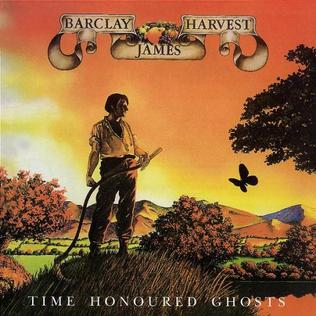

{fig-align="center"}

Después de *Everyone is Everybody Else* y el doble álbum *BJH Live*, Barclay James Harvest cierra definitivamente la etapa Harvest (aunque los dos discos anteriores ya eran con Polydor) y se lanza a la aventura americana con *Time Honoured Ghosts*. Aunque ya estaban con Polydor, la portada está basada en una pintura titulada *Harvest*, lo que se puede entender como un tributo de la banda a su antigua discrográfica. Todo lo que se necesita saber de este álbum, como siempre, está en la [página oficial del grupo](https://www.bjharvest.co.uk/thg.htm). 

Comercialmente fue un álbum fallido, BJH nunca tuvo entrada en los Estados Unidos y eso limitó mucho su éxito comercial: BJH sería para siempre un grupo europeo, para ser más preciso de Alemania, Suiza y Reino Unido, por este orden.

Musicalmente, el álbum es muy bueno y es una buena muestra de la época clásica de BJH con el cuarteto. Escuché este disco por primera vez en los años noventa, así que la recepción de algunas de sus canciones está muy mediatizada por las versiones del Live Tapes (más adelante hablaremos de discos en directo). Se empiezan a delimitar claramente las canciones de John Lees y las de Les Holroyd, y aquí aparece el primer tema de Woolly Wolstenholme, *Beyond the Grave*. En esta página web siempre hemos sido partidarios de Woolly, así que es una de mis canciones favoritas del disco. Para este disco, mi canción favorita de Les Holroyd es *Jonathan*, y la de John Lees *One Night*. También hay que mencionar a *Titles*, un muy buen homenaje a *The Beatles*, que seguro fueron una gran inspiración para el grupo al principio de su carrera.

