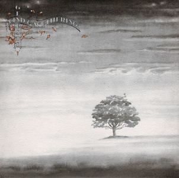

{fig-align="center"}

*Wind & Wuthering* es el cierre de la segunda etapa de la historia de Genesis. La primera se cerró con la salida de Peter Gabriel, y esta segunda con la de Steve Hackett. Se ha argumentado que esta segunda deserción hizo más daño que la primera. Visto en retrospectiva, la separación era inevitable, como se vio al comparar la producción posterior de Genesis y la de Hackett en solitario. Mientras que Banks, Collins y Rutherford tendían a una música más accesible, Hackett insistía en los sonidos complejos de los discos anteriores.

Esta tensión se puede ver en los temas de *Wind & Wuthering*. *Eleventh Earl of Mar* y *One for the Vine* representan el Genesis complejo, tanto en las letras como en la música. El otro extremo lo representan *Your Own Special Way* y *Afterglow*. Esto no está relacionado con la calidad musical: *Afterglow* es un tema absolutamente genial, parte del canon de Genesis, y *Your Own Special Way* una estupenda balada más compleja musicalmente de lo que parece. La mejor canción del disco, y de las mejores de Genesis, es *Blood on the Rooftops*. Es una inverosímil combinación Hackett/ Collins, con una introducción de guitarra acústica sobrenatural y una letra que contrasta fuertemente con la música, lo que la hace más interesante. *All in  Mouse’s Night* es una estupenda combinación del slapstick de Tom y Jerry con la música de Genesis, mostrando la improbable vena humorística de Tony Banks. El tiempo la ha vindicado, pero algunos justificaron la llegada del punk por esta canción. Finalmente, dos instrumentales: *Wot Gorilla?* es un tema de Collins en el estilo de Brand X, y *Unquiet Slumber for the Sleepers* seguida por *...In that Quiet Earth* son dos instrumentales sobrenaturales que ligaban a la perfección con *Afterglow* (hablaremos de esto más adelante cuando lleguemos al *Seconds Out*).

*Wind & Wuthering* es el adiós al Genesis británico y adscrito al rock progresivo. Después de esto, empezaba para Genesis su tercera época, la más larga y más pródiga en éxito comercial. 

