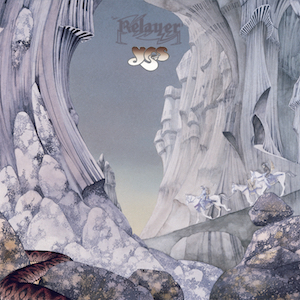

{fig-align="center"}

Después de la gira de *Tales from Topographic Oceans*, Rick Wakeman abandona Yes. Tras hacer audiciones a varios teclistas, uno de ellos Vangelis, Yes ficha al teclista suizo Patrick Moraz, un músico bastante ecléctico, con gustos que van del free jazz a la música brasileña. 

La adición de Moraz al grupo da como resultado *Relayer*. El disco tiene la misma estructura que *Close to the Edge*: un tema largo en una cara del LP, dos temas de unos diez minutos en la otra cara. El tema más ajeno al resto de la obra de Yes es *Sound Chaser*, que podría definirse como la aproximación de Yes al jazz. Además del sonido particular de Moraz, el tema añade varios solos de Squire y Howe. *To Be Over* es el tema más accesible y más próximo al sonido clásico de Yes. Tiene una sección instrumental muy buena, en la que destaca la guitarra de Steve Howe. La suite larga se titula *The Gates of Delirium*. Incluye temas muy diversos, tanto caóticos como melódicos. La sección final funciona como un tema autónomo, y es conocida como *Soon*. Ha formado parte del repertorio clásico de los conciertos de Yes desde entonces.

La portada de Roger Dean está basada en *The Gates of Delirium*: el uso de colores diferentes de obras anteriores (entre gris metálico y marrón claro) y la aparición de figuras humanas por primera vez en el arte de Roger Dean para Yes transmiten que *Relayer* es un cierto punto y aparte en la historia del grupo. Relayer es un disco extraño, aparte de la restante producción musical de Yes. En los discos siguientes volvió Rick Wakeman y Yes volvió a su sonido más clásico, pero ya lejos de la ambición musical de *Tales from Topographic Oceans*.

