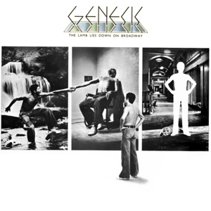

{fig-align="center"}

*The Lamb Lies Down on Broadway* (TLDB) es el último disco de Genesis con Peter Gabriel, y tiene un formato de doble álbum conceptual. Este formato es muy raro, pues obligaba a los fans a gastar más dinero en un disco doble, y al grupo a componer y grabar gran cantidad de material. Además el contenido desarrolla una historia o concepto, lo que hace las cosas más complicadas. En retrospectiva, Genesis se lanzó a un proyecto que requería de más energía de la que ellos podían disponer. El grupo se partió en dos: por un lado Peter Gabriel desarrollando la historia, y por otro el resto del grupo creando la música. A esto se añadió que cada uno de ellos desarrollaba su vida personal, lo que afectaba al rol que el grupo tenía en sus vidas. Todo esto llevó a la salida de Gabriel, que se decidió antes de la gira de promoción del disco. Significativamente, los siguientes discos de Genesis, siendo muchos de ellos muy buenos, no tuvieron la ambición de TLDB.

Uno de los grandes aciertos del concepto es la historia. El recurso fácil era acudir a algo similar al universo de Tolkien, que además era muy próximo al universo británico del grupo hasta entonces. Gabriel sugiere una historia mucho más oscura, centrada en el ambiente del Nueva York de 1974. Esta ambientación aparece sobre todo al principio del disco, en *The Grand Parade of Lifeless Packaging*. y en el propio título del disco. Otro elemento fundamental es articular la historia en torno al viaje del héroe, el puertorriqueño Rael. A medida que la historia avanza, el entorno se va difuminando y cobra más relevancia el viaje interior.

La música de TLDB es extraordinaria. Supone una evolución respecto de los discos de la época inglesa hacia un sonido más oscuro, a ratos experimental: *The Waiting Room* se ha definido como una “atonal jam”. *In The Cage* se incorporó a los conciertos de Genesis a partir de entonces, frecuentemente en un *medley* con otros temas que fueron cambiando con el tiempo. Los singles con que se promocionó el disco fueron *Carpet Crawlers*, *Counting Out Time* y TLDB.

A diferencia de otras épocas del grupo, costó mucho documentar TLDB en directo. En la gira del disco tocaban el disco entero y en orden, y como bis añadían algunos temas de discos anteriores. Durante mucho tiempo estaban disponibles sólo fotografías de la gira, sobre todo de la parte de Gabriel con el traje de Slipperman. En los 2010s aparecieron versiones de TLDB en directo, que sonaba extraordinariamente bien, y algunos grupos de tributo reconstruyeron el show entero, con las diapositivas, los trajes y la música original. El interés de TLDB en esta época da idea de su influencia y vigencia, mucho mayor de la que ha reconocido la crítica musical.

