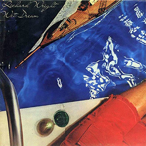

{fig-align="center"}

Entre *Animals* y *The Wall*, David Gilmour y Richard Wright se fueron a un estudio en la Costa Azul a grabar sus discos en solitario. El de David Gilmour tuvo cierta repercusión en las listas de éxitos, pero el de Richard Wright pasó inadvertido. En 2023, cuando Richard Wright hubiera cumplido ochenta años, Steven Wilson publicó un remix de *Wet Dream*, que supuso una recuperación de este disco en la escena del rock progresivo. La reaparición (se podría decir exhumación) de Wet Dream es un ejemplo de la labor de Steven Wilson como historiador del rock progresivo.

Seguramente *Wet Dream* no tuvo más éxito por la personalidad de Richard Wright. Era poco amigo de dar entrevistas, tenía una imagen pública discreta incluso en el escenario y fue eclipsado en su momento por la personalidad de David Gilmour y sobre todo de Roger Waters.

El sonido del disco muestra cómo Wright contribuyó al sonido de Pink Floyd desde los teclados, tal como dije en la reseña de *Wish You Were Here* de la semana pasada. Fiel a su carácter, en muchos temas tiene más protagonismo la guitarra de Snowy White, un músico de sesión que acompañó en directo a los miembros de Pink Floyd durante muchos años, así como el saxo de Mel Collins, que no podía faltar en un proyecto de este tipo.

Para su disco en solitario, Richard Wright tomó una aproximación similar a la de *Wish You Were Here*: buscar temas de su vida personal. Wright aparece como un inglés que ha ganado dinero y decide llevar una vida regalada en la Costa Azul, huyendo de las brumas y lluvias del Reino Unido, y del fisco extractivo de los gobiernos laboristas de la época. La canción que más muestra esto es *Holiday*. Bien está que sea así: no vamos a estar siempre comiéndonos la olla con los traumas personales de Roger Waters, a veces tenemos que salir a tomar el sol en una terraza, tomando una copa de vino blanco.

