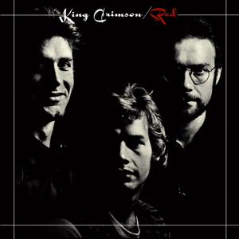

{fig-align="center"}

*Red* es el último disco de la formación de King Crimson incluyendo a John Wetton y Bill Bruford. Estuvieron activos en 1973 y 1974, sacaron tres discos y dieron muchos conciertos, en los que tocaban mucha música improvisada, uno de los rasgos distintivos del grupo. Durante ese tiempo, Fripp grabó *No Pussyfooting* con Brian Eno. Se podría decir que fue el único grupo del género jazz rock progresivo, por el extensivo uso de la improvisación. A medida que iba pasando el tiempo iban cayendo miembros de la formación: primero Jamie Muir, luego David Cross. Cuando se publicó *Red*, King Crimson ya se había disuelto: Robert Fripp estaba totalmente agotado e ingresó en la *International Academy for Continuous Education* de J. G. Bennett.

*Red* cuenta con dos temas que han tenido mucha influencia en la música popular occidental: *Starless* y *Red*. *Starless* puede ser considerada la mejor música que ha producido King Crimson, por la la voz de Wetton y la espectacular guitarra de Fripp en la segunda parte de la canción. Varias generaciones de oyentes han sentido cosquilleos en la médula espinal con este tema. *Red* es al cien por cien de Fripp, en la línea de *Lark’s Tongues in Aspic, Part Two*, y en cierta manera de *21st Century Schizoid Man*. Riffs de guitarra predecesores del hard rock, y de géneros enteros como el hard rock.

El disco tiene tres temas más: *Providence* es una improvisación en directo con la participación de David Cross. *Fallen Angel* y *One More Red Nightmare* son otros dos temas excelentes, en los que destacan los saxos de Ian McDonald y Mel Collins, y la corneta de Mark Charig. El regreso de Mel Collins y de Ian McDonald representaba regresar a una etapa anterior del grupo. Pero esa etapa anterior, que musicalmente había quedado muy atrás, había acabado en 1972 con Earthbound, y sólo habían pasado tres años desde la publicación de Islands en 1971. En aquella época la actividad musical era frenética y la evolución de los grupos mucho más rápida de lo que sería años después.

