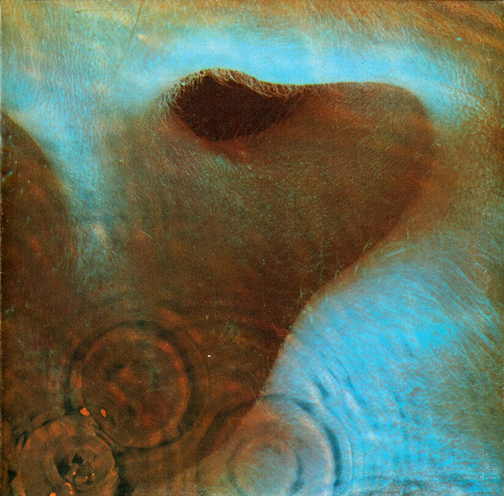

{fig-align="center"}

*Meedle* presenta el resultado de la colaboración creativa de los miembros de Pink Floyd en 1971, después de *Atom Heart Mother* y antes de *Dark Side of the Moon*. La segunda cara del disco la ocupa totalmente *Echoes*, una excelente suite de 23 minutos. Contiene diversos fragmentos experimentales, como la primera nota del tema, para la que usaron la primera grabación porque no la pudieron reproducir después, y algunos pasajes hacia la segunda mitad que recuerdan su trabajo en bandas sonoras y discos experimentales como *Ummagumma*. Pero también tiene partes muy melódicas, destacando el uso de voces, guitarra y teclado, sobre todo al principio y al final donde se encuentran las partes cantadas del tema. Un ejemplo de la utilidad de la experimentación: la música extraña, atonal y caótica es el camino a la evolución a un nuevo estadio de la música más digerible para el gran público.

El tema más perdurable de la primera cara es *One of These Days*, que empieza con dos bajos martillando en estéreo. Más adelante, Nick Mason nos amenaza con cortarnos en pedazos. Otro tema interesante es *Fearless*, en el que introducen cantos de los hinchas del Liverpool hacia el final, que forman parte de la pieza musical. También está Seamus, un tema de blues en el que canta un perro, nombrado por los fans como de los peores de Pink Floyd. La verdad es que el perro se integra bastante bien en la canción.

Este disco representa un final de época para Pink Floyd. En discos posteriores dejarán de lado la parte experimental de su música y se dirigirán más al gran público: hace unos meses ya dije que *The Dark Side of the Moon* aparece la música de radio FM, que tanto sonaría en los años ochenta. Y se va acercando cada vez más, poco a poco, la captura del grupo por la voluntad y el impulso creativo de Roger Waters.

