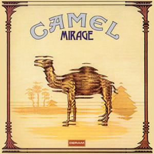

{fig-align="center"}

Aunque es el segundo disco, *Mirage* es realmente la presentación de Camel en la escena del rock progresivo. Entraron unos pocos años más tarde que los grupos fundacionales. La propuesta de Camel es un *prog* muy melódico, con predominio de la parte instrumental, articulada en diálogos de guitarra y teclado con una sección rítmica que funcionaba como un reloj. Como es sabido, los miembros fijos del grupo durante los primeros años fueron el guitarrista Andy Latimer y el teclista Peter Bardens. En este disco, la base rítma eran el bajista Doug Ferguson y el batería Andy Ward.

Tenemos cinco temas, tres en la primera cada y dos en la segunda. Tres de los temas son cortos, dos son largos y con varias secciones. Empezando por los cortos, *Supertwister* y *Earthrise* son dos temas instrumentales. En el primero aparece por primera vez la flauta de Andy Latimer. A partir de entonces, apareció en muchos temas de Camel, pero siempre en la medida justa para no empalagar. Los dos temas son excelentes, de los primeros temas instrumentales de Camel donde es agradable quedarse a vivir durante un rato, con teclados y guitarra alternándose con gusto exquisito. *Freefall* es tiene parte vocal, pero es de un tono similar a los otros dos temas cortos.

Yendo a los temas largos, *Lady Fantasy* es sin duda uno de los clásicos de Camel. Más energético que el resto de su músico, funcionó muy bien para cerrar los conciertos del grupo. *The White Rider* está inspirada en la obra de Tolkien. Contiene efectos expresivos como fanfarrias interpretadas con teclado, y pasan muchísimas cosas en sus nueve minutos. Pocos años después, Camel revistó este concepto para the Snow Goose, extendiendólo a todo el disco.

Con *Mirage* Camel introduce una nueva propuesta de rock progresivo, más melódica e influenciada por el jazz y el pop que los otros grupos. La portada basada en el paquete de tabaco fue la imagen del grupo durante los años setenta.

